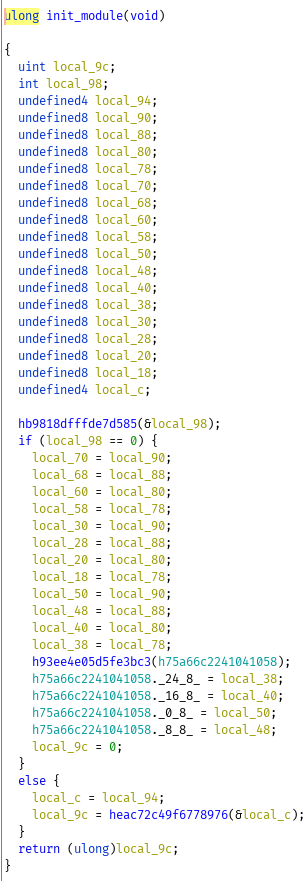
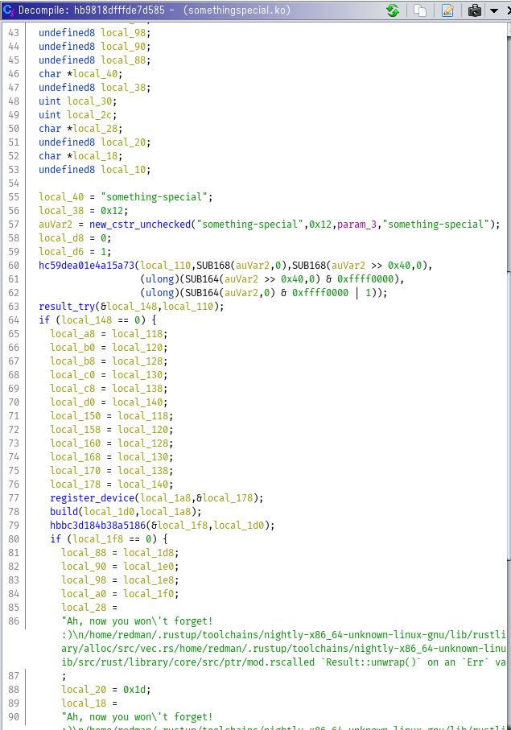

# Volatile Personality

## Description

We successfully exploited a target, but the IDS detected us! The only thing we got was this
memory snapshot; think you can extract the flag from it?

## Solution

We're provided a memory snapshot and the flag is presumably somewhere inside of it.  After trying and failing the obvious (strings lol), the next thing to do is look for a memory dump analysis tool.  The one i'll be using in this writeup is Volatility.  It should be noted that 2.6.1 doesn't quite work - I had to use the bleeding version off of github.  

### creating the profile

To work correctly Volatility requires a "profile" of the target system.  A profile is essentially a zip file with information on OS data structures that Volatility can use to find relevant information.  The easiest way to make one of these is just build a VM with the same operating system as your target and build it off of that.  Can we figure out which operating system the system was using?  

`strings mem.lime | grep "Linux"` gives us the line
`Aug 27 02:53:33 redman-dev kernel: [    0.000000] Linux version 5.4.0-42-generic (buildd@lgw01-amd64-038) (gcc version 9.3.0 (Ubuntu 9.3.0-10ubuntu2)) #46-Ubuntu SMP Fri Jul 10 00:24:02 UTC 2020 (Ubuntu 5.4.0-42.46-generic 5.4.44)`

Knowing that it is Ubuntu tells us a little bit more about the mem dump and where we should be looking for the specific version. 
`strings mem.lime | grep "deb "` gives us `deb http://mirror.dal10.us.leaseweb.net/ubuntu focal main restricted`.  Our dumped system is running Ubuntu 20.04 Focal Fossa

After creating a VM of the system the process to create a profile is pretty simple.  
```bash
apt update
apt install linux-headers-generic dwarfdump build-essential
git clone https://github.com/volatilityfoundation/volatility.git
cd volatility/tools/linux/ && make
cd ../../../
zip $(lsb_release -i -s)_$(uname -r)_profile.zip ./volatility/tools/linux/module.dwarf /boot/System.map-$(uname -r)
```

Aftering creating the profile you just need to grab it off your VM and place it in ./plugins/overlays/linux under your volatility installation. 

### reviewing the memory dump

```text
❯ python2 volatility/vol.py -f mem.lime --profile=LinuxUbuntu_5_4_0-42-generic_profilex64 -h
...
	Supported Plugin Commands:

		imagecopy      	Copies a physical address space out as a raw DD image
		limeinfo       	Dump Lime file format information
		linux_apihooks 	Checks for userland apihooks
		linux_arp      	Print the ARP table
		linux_aslr_shift	Automatically detect the Linux ASLR shift
		linux_banner   	Prints the Linux banner information 
		linux_bash     	Recover bash history from bash process memory
		linux_bash_env 	Recover a process' dynamic environment variables
		linux_bash_hash	Recover bash hash table from bash process memory
		linux_check_afinfo	Verifies the operation function pointers of network protocols
		linux_check_creds	Checks if any processes are sharing credential structures
		linux_check_fop	Check file operation structures for rootkit modifications
		linux_check_idt	Checks if the IDT has been altered 
		linux_check_inline_kernel	Check for inline kernel hooks
		linux_check_modules	Compares module list to sysfs info, if available
		linux_check_syscall	Checks if the system call table has been altered 
		linux_check_tty	Checks tty devices for hooks
		linux_cpuinfo  	Prints info about each active processor
		linux_dentry_cache	Gather files from the dentry cache
		linux_dmesg    	Gather dmesg buffer
		linux_dump_map 	Writes selected memory mappings to disk 
		linux_dynamic_env	Recover a process' dynamic environment variables
		linux_elfs     	Find ELF binaries in process mappings
		linux_enumerate_files	Lists files referenced by the filesystem cache
		linux_find_file	Lists and recovers files from memory
		linux_getcwd   	Lists current working directory of each process
		linux_hidden_modules	Carves memory to find hidden kernel modules
		linux_ifconfig 	Gathers active interfaces
		linux_info_regs	It's like 'info registers' in GDB. It prints out all the
		linux_iomem    	Provides output similar to /proc/iomem
		linux_kernel_opened_files	Lists files that are opened from within the kernel
		linux_keyboard_notifiers	Parses the keyboard notifier call chain
		linux_ldrmodules	Compares the output of proc maps with the list of libraries from libdl
		linux_library_list	Lists libraries loaded into a process 
		linux_librarydump	Dumps shared libraries in process memory to disk
		linux_list_raw 	List applications with promiscuous sockets
		linux_lsmod    	Gather loaded kernel modules
		linux_lsof     	Lists file descriptors and their path
		linux_malfind  	Looks for suspicious process mappings
		linux_memmap   	Dumps the memory map for linux tasks
		linux_moddump  	Extract loaded kernel modules
		linux_mount    	Gather mounted fs/devices
		linux_mount_cache	Gather mounted fs/devices from kmem_cache
		linux_netfilter	Lists Netfilter hooks
		linux_netscan  	Carves for network connection structures
		linux_netstat  	Lists open sockets
		linux_pidhashtable	Enumerates processes through the PID hash table
		linux_pkt_queues	Writes per-process packet queues out to disk
		linux_plthook  	Scan ELF binaries' PLT for hooks to non-NEEDED images
		linux_proc_maps	Gathers process memory maps
		linux_proc_maps_rb	Gathers process maps for linux through the mappings red-black tree
		linux_procdump 	Dumps a process's executable image to disk
		linux_process_hollow	Checks for signs of process hollowing
		linux_psaux    	Gathers processes along with full command line and start time
		linux_psenv    	Gathers processes along with their static environment variables
		linux_pslist   	Gather active tasks by walking the task_struct->task list
		linux_pslist_cache	Gather tasks from the kmem_cache
		linux_psscan   	Scan physical memory for processes 
		linux_pstree   	Shows the parent/child relationship between processes
		linux_psxview  	Find hidden processes with various process listings
		linux_recover_filesystem	Recovers the entire cached file system from memory
		linux_route_cache	Recovers the routing cache from memory 
		linux_sk_buff_cache	Recovers packets from the sk_buff kmem_cache
		linux_slabinfo 	Mimics /proc/slabinfo on a running machine
		linux_strings  	Match physical offsets to virtual addresses (may take a while, VERY verbose)
		linux_threads  	Prints threads of processes 
		linux_tmpfs    	Recovers tmpfs filesystems from memory
		linux_truecrypt_passphrase	Recovers cached Truecrypt passphrases 
		linux_vma_cache	Gather VMAs from the vm_area_struct cache
		linux_volshell 	Shell in the memory image
		linux_yarascan 	A shell in the Linux memory image
		mbrparser      	Scans for and parses potential Master Boot Records (MBRs) 
		patcher        	Patches memory based on page scans
		raw2dmp        	Converts a physical memory sample to a windbg crash dump
		vmwareinfo     	Dump VMware VMSS/VMSN information
```
There are a lot of plugins available to us, checking bash_history is a good place to start. 

```text
❯ python2 volatility/vol.py -f mem.lime --profile=LinuxUbuntu_5_4_0-42-generic_profilex64 linux_bash
Volatility Foundation Volatility Framework 2.6.1
Pid      Name                 Command Time                   Command
-------- -------------------- ------------------------------ -------
    1903 bash                 2020-08-27 02:56:11 UTC+0000   cd git/
    1903 bash                 2020-08-27 02:56:11 UTC+0000   ls
    1903 bash                 2020-08-27 02:56:11 UTC+0000   cd something-special/
    1903 bash                 2020-08-27 02:56:11 UTC+0000   cd linux-kernel-module-rust/
    1903 bash                 2020-08-27 02:56:11 UTC+0000   ls
    1903 bash                 2020-08-27 02:56:11 UTC+0000   ls
    1903 bash                 2020-08-27 02:56:11 UTC+0000   sudo insmod somethingspecial.ko 
    1903 bash                 2020-08-27 02:56:11 UTC+0000   ls
    1903 bash                 2020-08-27 02:56:17 UTC+0000   cd $(mktemp -d)
    1903 bash                 2020-08-27 02:56:40 UTC+0000   git clone https://github.com/504ensicsLabs/LiME.git
    1903 bash                 2020-08-27 02:56:45 UTC+0000   cd LiME/src/
    1903 bash                 2020-08-27 02:56:45 UTC+0000   ls
    1903 bash                 2020-08-27 02:56:46 UTC+0000   make
    1903 bash                 2020-08-27 02:56:51 UTC+0000   ls
    1903 bash                 2020-08-27 02:58:43 UTC+0000   sudo insmod lime-5.4.0-42-generic.ko "path=tcp:4444 compress=1 format=lime"
```

So the challenge author installed a kernel module and then took the memory dump.  It seems pretty likely that this kernel module is relevant to our flag hunting efforts so let's see if we can pull it from the dump.  

```
❯ python2 volatility/vol.py -f mem.lime --profile=LinuxUbuntu_5_4_0-42-generic_profilex64 linux_enumerate_files | grep "somethingspecial.ko"
Volatility Foundation Volatility Framework 2.6.1
0xffffa038b992ebf0                    544016 /home/redman/git/linux-kernel-module-rust/something-special/somethingspecial.ko
```

```
❯ python2 volatility/vol.py -f mem.lime --profile=LinuxUbuntu_5_4_0-42-generic_profilex64 linux_find_file -i 0xffffa038b992ebf0 -O somethingspecial.ko
```
linux_enumerate_files gets us the information we need to pull a file out of the dump and linux_find_file will actually do it.  


### ghidra review

note: i've renamed some symbols from the obfuscated form, i'll try and give enough context to match symbols to their original form.  



The init_module function is somewhat painful to look at but fairly simple.  It runs a function and then branches based on the result.  Let's take a look at that first function!  



This function is also reasonably straightforward.  It calls a function, propagates result errors outwards, calls another function, etc.  We could look closer at the decompilation but fortunately that is not necessary because the symbols include the library name these functions are from.  


A quick google search for "linux kernel module rust" brings us to [it's github repository](https://github.com/fishinabarrel/linux-kernel-module-rust) and more particularly [the chrdev.rs file](https://github.com/fishinabarrel/linux-kernel-module-rust/blob/master/src/chrdev.rs)

```rust
    pub fn build(self) -> KernelResult<Registration> {
        let mut dev: bindings::dev_t = 0;
        let res = unsafe {
            bindings::alloc_chrdev_region(
                &mut dev,
                self.minors.start.into(),
                self.minors.len().try_into()?,
                self.name.as_ptr() as *const c_types::c_char,
            )
        };
        if res != 0 {
            return Err(Error::from_kernel_errno(res));
        }

        // Turn this into a boxed slice immediately because the kernel stores pointers into it, and
        // so that data should never be moved.
        let mut cdevs = vec![unsafe { mem::zeroed() }; self.file_ops.len()].into_boxed_slice();
        for (i, file_op) in self.file_ops.iter().enumerate() {
            unsafe {
                bindings::cdev_init(&mut cdevs[i], &file_op.0);
                cdevs[i].owner = &mut bindings::__this_module;
                let rc = bindings::cdev_add(&mut cdevs[i], dev + i as bindings::dev_t, 1);
                if rc != 0 {
                    // Clean up the ones that were allocated.
                    for j in 0..=i {
                        bindings::cdev_del(&mut cdevs[j]);
                    }
                    bindings::unregister_chrdev_region(dev, self.minors.len() as _);
                    return Err(Error::from_kernel_errno(rc));
                }
            }
        }

        Ok(Registration {
            dev,
            count: self.minors.len(),
            cdevs,
        })
    }
```

somethingspecial.ko adds a character device when loaded.  Instead of trying to reverse the rest of this module we're just going to see what happens when we use the character device.  

### getting the flag

We still have the Ubuntu VM from earlier so we can just use that.  

`sudo insmod somethingspecial.ko`

```
teddy@teddy-Standard-PC-Q35-ICH9-2009:~$ ls /dev
autofs           log           snd     tty3   tty56      ttyS23   vcsa1
block            loop0         sr0     tty30  tty57      ttyS24   vcsa2
bsg              loop1         stderr  tty31  tty58      ttyS25   vcsa3
btrfs-control    loop2         stdin   tty32  tty59      ttyS26   vcsa4
bus              loop3         stdout  tty33  tty6       ttyS27   vcsa5
cdrom            loop4         tty     tty34  tty60      ttyS28   vcsa6
char             loop5         tty0    tty35  tty61      ttyS29   vcsu
console          loop6         tty1    tty36  tty62      ttyS3    vcsu1
core             loop7         tty10   tty37  tty63      ttyS30   vcsu2
cpu_dma_latency  loop-control  tty11   tty38  tty7       ttyS31   vcsu3
cuse             mapper        tty12   tty39  tty8       ttyS4    vcsu4
disk             mcelog        tty13   tty4   tty9       ttyS5    vcsu5
dri              mem           tty14   tty40  ttyprintk  ttyS6    vcsu6
dvd              mqueue        tty15   tty41  ttyS0      ttyS7    vda
ecryptfs         net           tty16   tty42  ttyS1      ttyS8    vda1
fb0              null          tty17   tty43  ttyS10     ttyS9    vda2
fd               nvram         tty18   tty44  ttyS11     udmabuf  vda5
full             port          tty19   tty45  ttyS12     uhid     vfio
fuse             ppp           tty2    tty46  ttyS13     uinput   vga_arbiter
hidraw0          psaux         tty20   tty47  ttyS14     urandom  vhci
hpet             ptmx          tty21   tty48  ttyS15     userio   vhost-net
hugepages        pts           tty22   tty49  ttyS16     vcs      vhost-vsock
hwrng            random        tty23   tty5   ttyS17     vcs1     virtio-ports
i2c-0            rfkill        tty24   tty50  ttyS18     vcs2     vport1p1
initctl          rtc           tty25   tty51  ttyS19     vcs3     vport1p2
input            rtc0          tty26   tty52  ttyS2      vcs4     zero
kmsg             sg0           tty27   tty53  ttyS20     vcs5     zfs
kvm              shm           tty28   tty54  ttyS21     vcs6
lightnvm         snapshot      tty29   tty55  ttyS22     vcsa
```

I don't see anything under /dev but /proc/devices shows that the device is registered (and the major version for the device).  

```
teddy@teddy-Standard-PC-Q35-ICH9-2009:~$ cat /proc/devices 
Character devices:
...
239 something-special
...
```

Let's just try making a filesystem node for that device.  

`sudo mknod somethingspecial c 239 0`

`cat somethingspecial` gives us an endless repeating stream of `gigem{redman_has_bad_memory}` - which is the flag we're looking for!

flag: `gigem{redman_has_bad_memory}`

## Creation

First, we create a Ubuntu 20.04 Server VM. How you do this is mostly up to you, but I used
QEMU/KVM. In this VM, we create a user who downloads the [linux-kernel-module-rust] library and
adds the something-special folder present in this directory. something-special is compiled
and `insmod`'d into existence. Logout.

The "attacker" comes in, builds LiME forensics suite for imaging the physical memory space.
This image is then exfiltrated over TCP in compressed format to the attacker. Logout.


[linux-kernel-module-rust]: https://github.com/fishinabarrel/linux-kernel-module-rust/blob/master/tests/chrdev/tests/tests.rs
