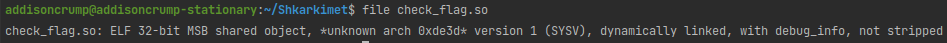
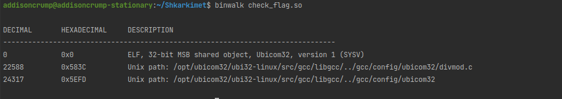
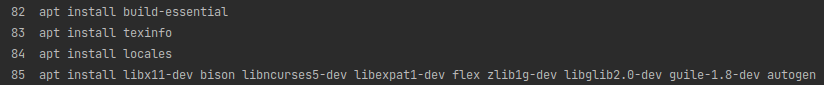
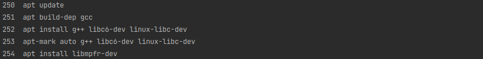
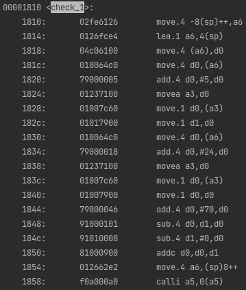
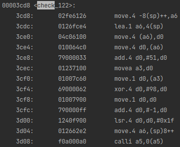

# dubious

You completed your angr management course, but you're a little dubious about whether it was effective.

It definitely isn't for this. Pass all checks to get the flag.

## Solution

Note that this solution was not written for the binary which was used during the competition, but the solution script
was tested on the binary used in the competition before competition start. There are discrepancies only in the specific
values used in the `check_xxx` functions and the component of the flag which was generated.

### Identification

The first thing to do is to identify what check_flag.so even is. `file` correctly identifies it as an ELF, but not the
architecture info:



Our second option, a little more successful, is `binwalk`, which successfully identifies it as an Ubicom32 shared object
file:



Even more specifically, it looks like this was compiled for the Linux triple, based on the Unix paths binwalk
discovered.

### Installation

A little google-fu later, we find the [toolchain](https://wiki.codeaurora.org/xwiki/bin/Ubicom/Ubicom32%20Tool%20Chain/)!
Looking at the build dependencies and comparing with those in the Ubuntu apt repositories, it looks like all the
dependencies we need are present in Ubuntu 16.04 (Xenial). Quickest way to set that up is with debootstrap and a chroot
or a systemd-nspawn container.

What follows is a series of woes relating to dependency hell...




But finally, we execute `build_ubi32.sh` and build the toolchain. Success!

### Inspection

Using objdump to dump the assembly of the ELF, we find quite a few functions of the naming pattern `check_xxx`, with xxx
being some numbers:



While it may not be the exact same toolchain, I can't actually find an IP8K ISA reference (go figure), but I can find an
IP5K ISA reference with [very similar mnemonics and operands](http://www.texim-europe.com/getfile.aspx?id=68544). We'll
lean on that for now.

A few things we notice about these checks:

1. This architecture is super cursed. (`-8(sp)++` haunts my dreams)
2. These checks all look very similar, as though they were generated. It's probably a good guess that they were.
3. There are index-based accesses of a parameter (pointer copy at 1814, offset at 1820 and 1834, and byte access at 1828
   and 183c) which are stashed in d1 and d0.
4. d0 then has a value added, and d1 and d0 are compared for equality using subtraction and checking the carry bit with
   addc (addresses 1844-1850)
5. Function returns using calli (because, for some reason, calli is faster than ret on leaf functions according to the
   ISA reference)
   
There end up being a total of 4 or 5 different versions of these checks, depending on the size of the compared value or
if the zero-th index of the pointer is used, and then finally a straight up equality comparison:



This effectively pins one value to a specific index and the other comparisons are between different indices. We'll need
to script this.

### Automation

Because I'm a z3 and a Rust nut, I used Rust and z3 to solve this by parsing each assembly code pattern with regex and
effectively dumping the constraints into z3 for solving. That code is available in [the solver directory](solver/src/main.rs).

Running this satisfyingly extracts all the values:

```
0 => p[37] == 209 + p[30]
1 => p[5] == 70 + p[24]
2 => p[53] == 228 + p[15]
3 => p[30] == 24 + p[19]
4 => p[60] == 190 + p[25]
5 => p[22] == 19 + p[23]
6 => p[60] == 198 + p[4]
7 => p[56] == 204 + p[0]
8 => p[48] == 1 + p[34]
9 => p[47] == 187 + p[61]
10 => p[20] == 226 + p[61]
11 => p[38] == 204 + p[49]
12 => p[49] == 248 + p[18]
13 => p[50] == 1 + p[28]
14 => p[23] == 47 + p[14]
15 => p[25] == 61 + p[47]
16 => p[22] == 60 + p[43]
17 => p[57] == 253 + p[55]
18 => p[23] == 41 + p[43]
19 => p[45] == 43 + p[54]
20 => p[16] == 6 + p[44]
21 => p[15] == 31 + p[14]
22 => p[61] == 17 + p[16]
23 => p[24] == 252 + p[52]
24 => p[14] == 209 + p[20]
25 => p[42] == 2 + p[10]
26 => p[4] == 30 + p[15]
27 => p[49] == 248 + p[18]
28 => p[19] == 225 + p[44]
29 => p[0] == 53 + p[42]
30 => p[56] == 199 + p[16]
31 => p[2] == 8 + p[30]
32 => p[15] == 23 + p[58]
33 => p[12] == 254 + p[45]
34 => p[47] == 214 + p[36]
35 => p[14] == 201 + p[0]
36 => p[2] == 1 + p[44]
37 => p[27] == 18 + p[50]
38 => p[59] == 6 + p[28]
39 => p[47] == 215 + p[34]
40 => p[12] == 47 + p[21]
41 => p[29] == 15 + p[6]
42 => p[11] == 14 + p[30]
43 => p[22] == 66 + p[14]
44 => p[52] == 9 + p[10]
45 => p[19] == 248 + p[15]
46 => p[48] == 44 + p[54]
47 => p[37] == 247 + p[39]
48 => p[8] == 211 + p[48]
49 => p[9] == 2 + p[55]
50 => p[48] == 253 + p[3]
51 => p[60] == 212 + p[20]
52 => p[3] == 240 + p[25]
53 => p[21] == 202 + p[44]
54 => p[8] == 214 + p[23]
55 => p[0] == 55 + p[21]
56 => p[51] == 27 + p[19]
57 => p[39] == 1 + p[47]
58 => p[54] == 253 + p[52]
59 => p[49] == 54 + p[35]
60 => p[38] == 250 + p[58]
61 => p[14] == 252 + p[50]
62 => p[3] == 45 + p[47]
63 => p[34] == 248 + p[1]
64 => p[28] == 205 + p[41]
65 => p[52] == 215 + p[36]
66 => p[4] == 10 + p[6]
67 => p[56] == 237 + p[27]
68 => p[29] == 57 + p[46]
69 => p[26] == 14 + p[58]
70 => p[28] == 1 + p[57]
71 => p[26] == 231 + p[23]
72 => p[6] == 254 + p[3]
73 => p[49] == 51 + p[32]
74 => p[8] == 2 + p[32]
75 => p[11] == 54 + p[9]
76 => p[8] == 207 + p[33]
77 => p[0] == 1 + p[41]
78 => p[10] == 209 + p[30]
79 => p[51] == 41 + p[52]
80 => p[15] == 237 + p[40]
81 => p[41] == 46 + p[58]
82 => p[50] == 206 + p[33]
83 => p[17] == 180 + p[61]
84 => p[24] == 4 + p[17]
85 => p[12] == 40 + p[9]
86 => p[55] == 5 + p[21]
87 => p[1] == 49 + p[58]
88 => p[18] == 60 + p[38]
89 => p[43] == 254 + p[47]
90 => p[25] == 66 + p[32]
91 => p[26] == 224 + p[49]
92 => p[27] == 212 + p[22]
93 => p[36] == 252 + p[49]
94 => p[37] == 196 + p[16]
95 => p[39] == 188 + p[61]
96 => p[42] == 189 + p[25]
97 => p[50] == 251 + p[59]
98 => p[57] == 255 + p[56]
99 => p[7] == 19 + p[48]
No match found for 100
101 => p[1] == 10 + p[23]
102 => p[55] == 2 + p[53]
103 => p[59] == 216 + p[45]
104 => p[11] == 61 + p[35]
105 => p[1] == 7 + p[40]
106 => p[12] == 253 + p[40]
107 => p[12] == 234 + p[7]
108 => p[13] == 249 + p[5]
109 => p[11] == 60 + p[17]
110 => p[24] == 252 + p[46]
111 => p[7] == 60 + p[52]
112 => p[53] == 250 + p[46]
113 => p[2] == 245 + p[29]
114 => p[59] == 190 + p[5]
115 => p[31] == 49 + p[38]
116 => p[33] == 241 + p[7]
117 => p[51] == 41 + p[52]
118 => p[13] == 68 + p[35]
119 => p[31] == 252 + p[2]
120 => p[31] == 42 + p[39]
121 => p[3] == 241 + p[13]
122 => 98 == p[51]
Password discovered: gigem{cu570m_t0Ol1nG_0r_5uFF3r_c3fa0b029bf26fa98bf4b936532893}
```

Note in particular that there's even some redundancy, which is very nice (we didn't have to make a special case for
check_100).
