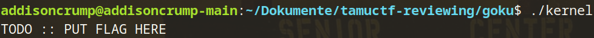
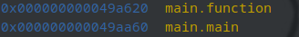
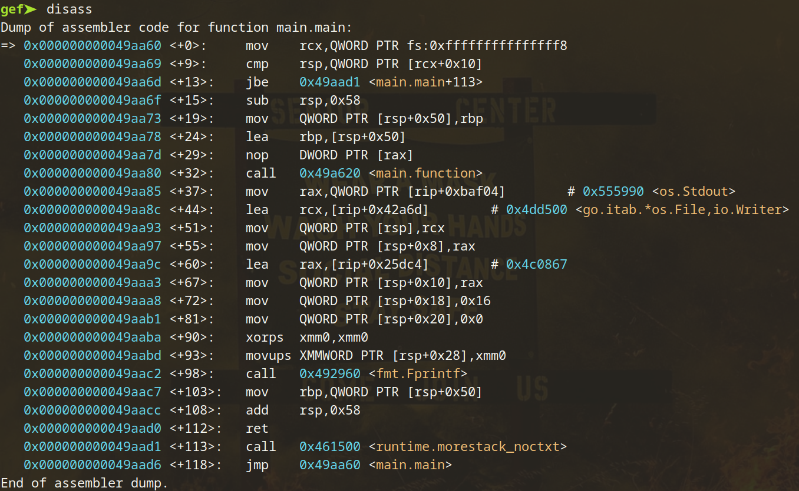
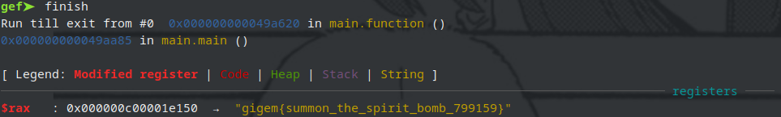

#  Goku

## Description
Goku needs our help. Before he passed out he gave us a flash drive with an executable file that he says is necessary to stopping Vegeta. Can you reverse it and get the flag?

## Solution

Giving the binary a quick run results in nothing too special; seems to just start, print out some text, and quit.



Opening up the program in gdb and inspecting the functions, we see the following:



Now, I'm gonna tell you right now: if you attempt to reverse a Go binary statically by hand, you're gonna have a bad time.

There's a function, `main.function`, which is called by `main.main` immediately before a call to `os.Stdout` and `go.itab.*os.File,io.Writer`.



It's quite likely that this will print out a string. Following up on this, let's just go to after the `main.function` call. To do this, I invoked the following:

```
gef➤  break main.function 
gef➤  continue
gef➤  finish
```

Following this, I was delighted to see:



While frustrating that I don't know precisely what the process is to get to this flag, it simply isn't necessary for me to know given the stdout write hint.

`gigem{summon_the_spirit_bomb_799159}`