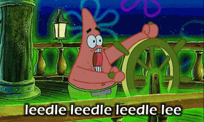

# Baud Ediquette

I was on the 6m band when the person I was chatting with was interrupted by a strange sound. It sounded something like this:

Someone definitely wasn't using the right mode. See if you can figure out what they transmitted.

* [Attachment](./signal.bin.zip)
* Center Frequency: 50.345 MHz
* Sample Rate: 1.8 MHz
* (hint: [what it actually sounded like](./sound.wav))

**NOTE:** due to character set restrictions, this flag will be in a slightly different format.

## Solution

The challenge author decided to write a highly in-depth solution walkthrough, available [on his website](https://komputerwiz.net/blog/2021/04/25/tamuctf-baud-etiquette/).
